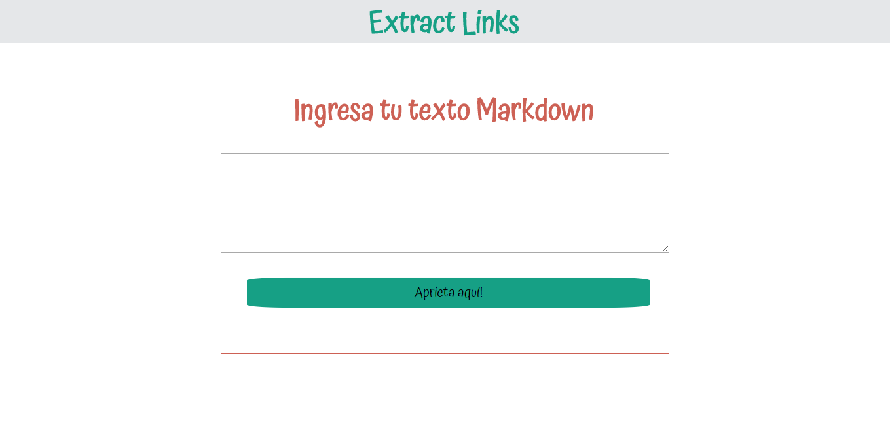

# Librería en Javascript
Una librería es un archivo o conjunto de archivos que se utilizan para facilitar la programación.

## Descripción
**markdown-extract-links** es una libreria que tiene como finalidad extraer todos los links encontrados de un texto en formato markdown. Puedes instalarlo como módulo en Node.js o implementarlo en tu página web.

### Metodología del Trabajo

* Herramienta de comunicación Slack, para estar en constante comunicación y poder cumplir con nuestra planificación.

* Se utiliza la metodología Agile para poder mejorar la eficiencia en relación al tiempo de producción y calidad del producto final.

* Como herramienta de planificación, creamos un calendario con las actividades a cumplir para poder así seguir la planificación de Laboratoria y llevar a cabo nuestro proyecto en el tiempo estimado.

### Requerimientos Técnicos

* Dependencias de Desarrollo
  
  + Node Js
  + Package Json.
  + ESLint ~v.4.15.0
  + Mocha
  + Chai
  

* Dependecias de Producción
  
  + Bootstrap ~v.4.0.0
  + jQuery ~v.3.1.1

### Instalación
#### NPM
* Hacer npm init
* Instala npm install --save ExtractLinks en la carpeta raíz de tu proyecto.
* Modifica lo siguiente con tu archivo markdown
  + let texto = fs.readFileSync('<markdown.md>').toString();
* En tu consola, posiciónate en la carpeta raíz de tu proyecto y ejecuta 'node index.js'
* El resultado será un objeto JSON, conteniendo cada link del archivo markdown seleccionado.

'[
  {"href":"https://es.wikipedia.org/wiki/Idioma_ingl%C3%A9s","text":"[ingles]"},
  {"href":"https://es.wikipedia.org/wiki/Drama","text":"[drama]"},
  {"href":"https://es.wikipedia.org/wiki/Verso","text":"[verso]"},
  {"href":"https://es.wikipedia.org/wiki/Romanticismo","text":"[románticos]"}
]'

# Desarrollado para 

## [Laboratoria](http://laboratoria.la/)